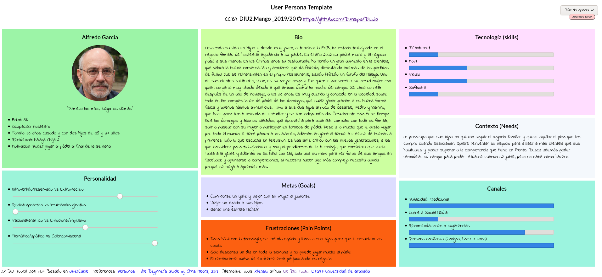
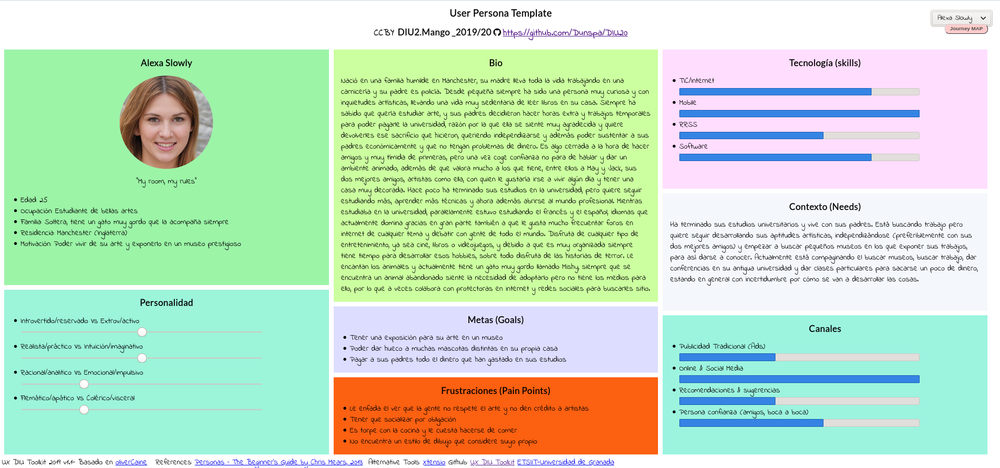
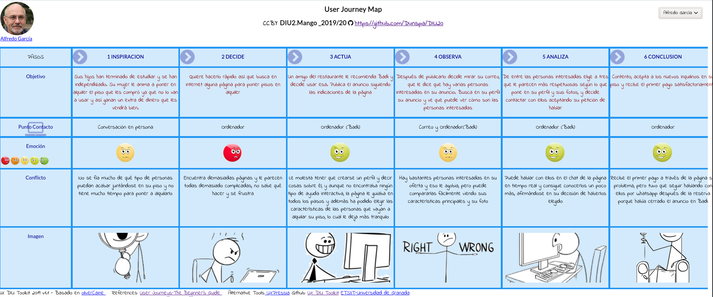
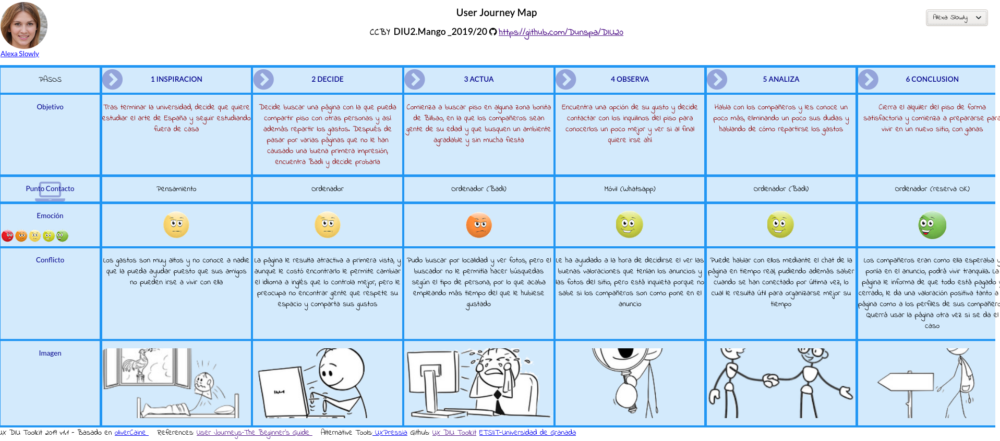

## DIU - Práctica 1

- Desk research: Análisis Competencia 
- 2 Personas 
- 2 User Journey Map  ( 1 por persona)
- Revisión de Usabilidad 

## A. Análisis de competencia

En la siguiente tabla se resume si varias páginas web de economía colaborativa basadas en un modelo B2C cumplen o no varias características importantes. Estas opciones asignadas son: Habitoom, Badi, Couchsurfing y Compartetupiso.

|                                              | Habitoom | **Badi** | Couchsurfing | Compartetupiso |
| -------------------------------------------- | -------- | -------- | ------------ | -------------- |
| Gratuito                                     | Sí       | Sí       | Sí           | Sí             |
| Tiene App                                    | No       | Sí       | Sí           | No             |
| Ayuda interactiva                            | No       | Sí       | No           | No             |
| Centrado en las personas                     | No       | Sí       | Sí           | Sí             |
| Recomendaciones personalizadas               | No       | Sí       | Sí           | No             |
| Gran base de usuarios                        | No       | Sí       | Sí           | Sí             |
| Chat con usuarios                            | No       | Sí       | No           | No             |
| Fácil de usar                                | Sí       | Sí       | Sí           | Sí             |
| Para buscar piso y/o alquilar el tuyo propio | Sí       | Sí       | Sí           | Sí             |
| Incluye paises de todo el mundo              | Sí       | Sí       | Sí           | Sí             |
| Control de pago seguro                       | No       | Sí       | No           | No             |

La opción elegida es **Badi** puesto que es la que he visto más simple y a la vez completa, con funciones interesantes para analizar como el chat y centrándose a la vez en los alojamientos y en las personas. Sigue un modelo simple de buscar alojamiento por lugar y según cómo son las personas con las que compartir alojamiento. Otras opciones como Couchsurfing se alejan un poco más del compartir alojamiento y gastos (puesto que la gente ofrece gratis el sitio) y no está tan pensada para largas estancias, por lo que ha sido descartada. Además, varias partes de la página no están traducidas al español, como la ayuda.

A todas ellas menos a Badi les falta la opción de tener ayuda interactiva, pese a ser bastante simples, un usuario poco experimentado puede tener problemas. Todas tienen FAQ pero es bastante pobre y te saca de la propia página por lo que puede resultar poco cómodo. Habitoom por su parte tiene un número de WhatsApp, pero es insuficiente porque no se da más ayuda que esa. Esta además tiene una base de usuarios muy pobre, por lo que ya es fácil descartarla ya que lo principal de estas páginas es tener mucha variedad de ofertas. Por ejemplo, busqué pisos en Granada y no existía ninguno. 

En el resto se pueden encontrar muchos usuarios, además de que son páginas ya muy conocidas de por sí.

Compartetupiso ofrece distintas categorías de compartir piso, sin embargo una vez en cada una de ellas la personalización es mínima, basándose el anuncio en un texto propiamente escrito por el interesado. Tanto en Compartetupiso como en Habitoom el funcionamiento consiste en otras personas contactando contigo, mediante los datos que tú proporcionas. Sin embargo Badi sí que tiene un chat, lo cual la hace más útil y simple al poder hablar con las personas directamente en la aplicación.

Badi, además, es la que más se centra en el usuario de las cuatro, puesto que al completar tu perfil te pregunta varias preguntas básicas sobre ti, a diferencia del resto de páginas donde esto sólo se explica en una caja de texto sin ninguna guía de qué poner, vale cualquier cosa.

En Badi siendo inquilino se controlan los pagos mediante la propia página, añadiendo un plus de seguridad que no tienen el resto, que dejan ese control a los usuarios fuera de la propia aplicación.

## B. Persona

Se han diseñado dos personas: **Alfredo** de 58 años y **Alexa** de 25. En sus respectivas fichas se pueden ver sus características principales y su biografía.

**Alfredo García** es un hombre hostelero de 58 años. Representa un tipo de persona bastante común, siendo alguien conocido en su localidad, amigable, querido, familiar y que además lleva su propio negocio. Es una persona con poco tiempo, y a la que le gusta desarrollar sus hobbies en ese poco tiempo, por lo que  es importante tener en cuenta que eso puede llevar a que esta persona pueda deshechar rápido una aplicación. Además, es torpe con la tecnología y se frustra fácilmente, que siempre es interesante a la hora de analizar cualquier aplicación para medir lo intuitiva o agradable al uso que puede ser esta. 

**Alexa Slowly** es una chica tímida e independiente de 25 años, estudiante y con muchas inquietudes intelectuales que quiere desarrollar, siendo un tipo de persona propensa a probar siempre nuevas cosas y, además, ser difícil de contentar debido a que es una persona competitiva y que se fija en los pequeños detalles. Es importante la primera impresión que pueda tener una aplicación en una persona de este tipo. También, al ser una persona tímida, puede tener problemas o ciertas preferencias a la hora de interactuar con otras personas en una aplicación, por lo que será cautelosa en ese sentido.

## C. User Journey Map

Lo más habitual en este tipo de aplicaciones es precisamente desarrollar sus dos actividades principales: buscar alojamiento y ofrecer alojamiento. 

La historia de Alfredo se basa en una persona que no tiene mucho manejo con la tecnología y además no tiene el tiempo para dedicarselo. Es importante que la aplicación sea clara y concisa, con guías paso a paso de lo que hacer para que la persona no abandone la página. Además, trata sobre varias funcionalidades de la página como el chat o el control del pago en el primer mes, que pueden facilitar mucho la estancia en la página y muestran lo positivo que puede ser que todo esté concentrado en un mismo lugar, sin tener que recurrir a otras herramientas externas.

La historia de Alexa refleja el cómo un diseño agradable a primera vista lo es todo, y como pequeños detalles como limitar las opciones de búsqueda pueden hacer perder el tiempo a la persona y que se frustre, además de que también ilustra el cómo es muy necesario que una página de economía colaborativa se centre en las personas y sus características.

**Alfredo Bummer**: "Alquilar el piso de sus hijos"

**Alexa Slowly**: "Buscar piso lejos con gente respetuosa"

## D. Revisión de Usabilidad

[**Documento: Revisión de Usabilidad**](./Usability-review.pdf)

El sitio web Badi tiene un diseño simple y atractivo, que permite realizar las funciones básicas satisfactoriamente, por lo que cualquier usuario va a poder realizar sus objetivos sin mucho problema. Es em general una de las mejores opciones para cualquier tipo de usuario, sobre todo el menos experimentado va a poder realizar lo más básico. Sin embargo, le falta refinar varias cosas de calidad de vida ya que es fácil perder el tiempo en la página debido a la poca personalización de las búsquedas y a lo verticalmente largas que son las páginas de anuncios. Por ejemplo un mejor chat, mejores búsquedas, un servicio de ayuda en línea disponible para todos los apartados y no solo la página principal y más funcionalidades que pueden ser muy útiles como compartición de gastos que tienen otras páginas, para en general poder centralizar todo lo que pueda derivar de la compartición de piso en la misma aplicación sin tener que salir a otras externas.

**Valoración final: 83 ** 