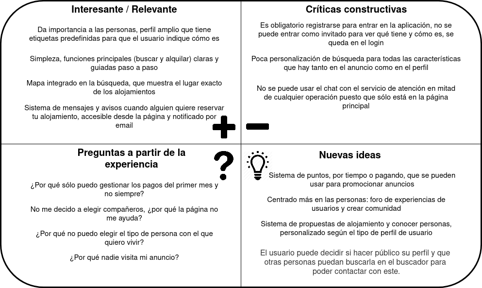
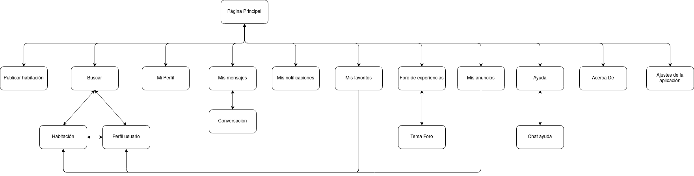
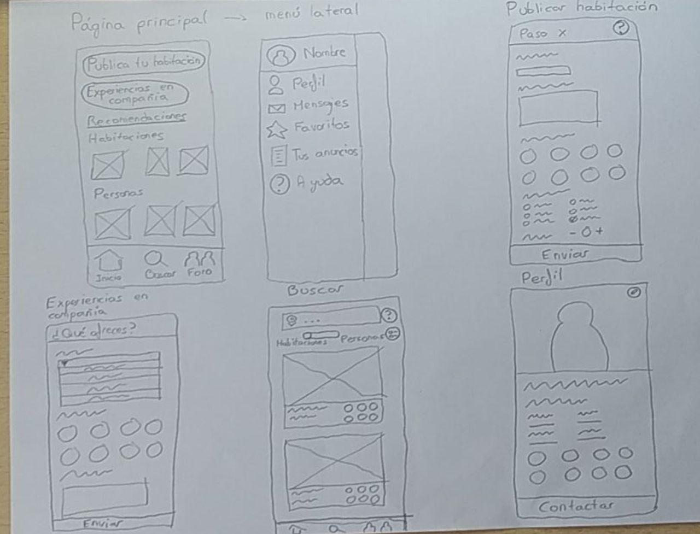
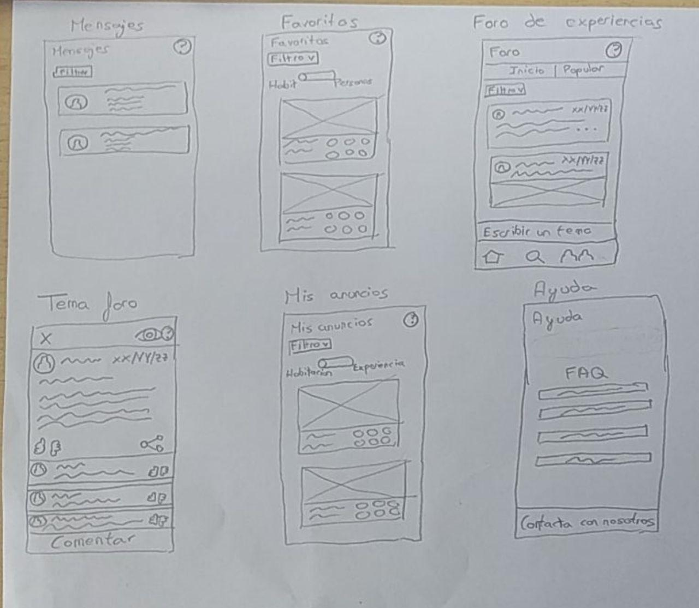

# DIU - Práctica 2

## A. Feedback Capture Grid

En la malla receptora de información (feedback capture grid) está representada la información obtenida de los usuarios de la práctica 1 y de mi propia experiencia, con el objetivo de abordar el diseño de la nueva aplicación.

Los cuatro apartados son:

- **Interesante/Relevante**, que indica los aspectos positivos que existen actualmente en el sitio analizado.
- **Críticas constructivas**, que indica los aspectos negativos que existen actualmente en el sitio analizado.
- **Preguntas a partir de la experiencia**, preguntas tienen las personas ficticias (y que pueden ser o no ser realizables) a partir de lo visto en los mapas de experiencia de usuario de la práctica 1.
- **Nuevas ideas**, ideas que sirven para mejorar el sitio a partir de la experiencia como desarrollador.

La nueva aplicación a desarrollar consiste en una aplicación de economía colaborativa de compartir piso, basada en *Badi*, pero con varias mejoras que mejoren la usabilidad y den más posibilidades a la aplicación. Las nuevas ideas que se proponen son las siguientes:

- Un sistema de puntos que el usuario puede ir ganando por pasar tiempo en la página, de forma gratuita, para así premiar que el usuario pase tiempo usando el servicio. Podrá emplear estos puntos en hacer que sus anuncios suban en importancia en el buscador y así poder encontrar interesados más rápido.
- Añadir una nueva función que amplie la experiencia social. En función de las características de las personas en sus perfiles, se ampliarán los servicios añadiendo un foro en el cual compartir experiencias en alojamientos que hayan sido gestionados por la aplicación, para así crear una comunidad de usuarios que compartan sus experiencias y puedan finalmente conocerse y querer compartir alojamiento.
- Añadir un nuevo sistema de propuestas de alojamiento, que recomiende al usuario sitios de alojamiento y perfiles de personas afines a las características de su perfil.
- Búsqueda de alojamiento de forma pasiva. En la aplicación base el usuario buscaba por sí mismo alojamiento, pero con este sistema el usuario puede también proponerse a sí mismo como alguien que busca alojamiento, para que ahora otras personas interesadas en buscar compañero encuentren el tipo de persona que desean. El usuario publica su perfil y, además, qué tipo de experiencia de compañero puede ofrecer: compartir aficiones, ayudar a personas mayores, trabajar juntos, etc.

El objetivo general de la nueva propuesta es que se centre más en las personas, teniendo la posibilidad de rellenar un perfil de usuario con varias características de la persona, para luego al filtrar las búsquedas, existan más posibilidades y poder buscar por tipo de persona.

Se pretende por tanto aumentar el "engagement" y el "retention" (que el usuario use mucho y con frecuencia el sistema, que lo necesite), pero que a la vez el usuario no pierda el tiempo, que visite con frecuencia el sitio pero para hacer justo todo lo que necesita sin perder el tiempo, estando satisfecho con el resultado ("happiness").

##       B. User/Task Matrix

Para identificar las tareas de la nueva propuesta de aplicación y su importancia se hará una matriz de tareas y usuarios (User/Task Matrix). En las filas se representan las tareas y en las columnas los grupos de usuarios que se pueden encontrar en la aplicación. En cada caso se representa la frecuencia de uso (Baja - B/Media - M/Alta - A) de esa tarea por parte del usuario. 

Las tareas en negrita son las que se consideran más críticas e importantes en la aplicación. Se tendrá más cuidado a la hora de diseñarlas en la propuesta final.

| Tareas/Usuarios                                              | Usuarios registrados | Usuarios no registrados | Administrador |
| ------------------------------------------------------------ | -------------------- | ----------------------- | ------------- |
| **Crearse un perfil**                                        |                      | L                       |               |
| Modificar el perfil                                          | L                    |                         |               |
| **Buscar/Visitar otros perfiles**                            | A                    | L                       |               |
| **Crear un anuncio de habitación**                           | L                    |                         |               |
| Modificar el anuncio de habitación                           | M                    |                         |               |
| **Buscar/Visitar un anuncio de habitación**                  | A                    | A                       |               |
| Valorar un anuncio de habitación                             | M                    |                         |               |
| Valorar a un compañero                                       | M                    |                         |               |
| Usar/consultar puntos de fidelidad                           | M                    |                         |               |
| **Publicarse como compañero de alojamiento**                 | L                    |                         |               |
| Recibir propuestas personalizadas de habitaciones y compañeros | A                    |                         |               |
| **Comentar/Consultar el foro de experiencias**               | A                    |                         |               |
| Usar el chat de atención al cliente                          | L                    | L                       | A             |
| Consultar el apartado de FAQ                                 | L                    | M                       |               |
| Consultar las notificaciones                                 | A                    |                         |               |
| Moderar el foro                                              |                      |                         | A             |

Se han definido tres tipos de usuarios, que son los más comunes en cualquier página: usuarios registrados, usuarios no registrados y administradores.

Todas las tareas relacionadas con las dos funciones principales de la aplicación, buscar habitación y alquilar habitación, son las que se han indicado como más importantes, ya que son imprescindibles para el funcionamiento normal de la aplicación.

## C. Information Architecture: Sitemap/Labelling

Mediante las técnicas de arquitectura de la información (Sitemap y Labelling) creamos la organización y estructura de los contenidos de una aplicación, que nos sirve para entender dónde estamos como usuarios y dónde está la información desde donde estamos. 

En el sitemap vemos representada la estructura de la página en un mapa, mientras que en el labelling describimos la función de todas aquellas etiquetas que aparecen en el mapa.

El labelling está adaptado a las normas de escritura de la web, es decir, usa lenguaje simple y claro, fácil de encontrar y fácil de saber a dónde nos lleva, para facilitar a los usuarios que cumplan rápidamente sus objetivos. Las etiquetas accesibles desde la página principal son simples de entender, están a primera vista y realizan las funciones principales de la aplicación.

| Etiqueta                    | Descripción                                                  |
| --------------------------- | ------------------------------------------------------------ |
| Página principal            | Página principal de la aplicación, accesible al iniciar la aplicación. Contiene el menú inferior, el menú lateral, las opciones de publicar habitación y experiencia en compañia, y recomendaciones personalizadas. |
| Publicar habitación         | Rellena un formulario con los distintos datos de la aplicación que quieres publicar. |
| Modificar habitación        | Permite modificar todos los datos de la habitación que has publicado. |
| Experiencias en compañía    | Rellena un formulario, publicando tu perfil y el tipo de experiencia en compañía que ofreces y/o buscas para que otros usuarios te puedan buscar y contactar. |
| Buscar                      | Buscar alojamiento o personas que buscan alojamiento, según distintos parámetros, principalmente localización. |
| Habitación                  | Anuncio de una habitación, con sus fotos, características y enlaces a los perfiles de compañeros y propietarios que forman parte de él. |
| Perfil Compañero            | Perfil de otro usuario de la web, con su foto, caracterísitcas y contacto. No puede modificarse. |
| Perfil                      | Tu perfil, con su foto, características y contacto. Puede modificarse. |
| Modificar perfil            | Permite modificar todos los datos de tu perfil.              |
| Mensajes                    | Notificaciones y mensajes para cuando alguien contacta contigo o te dan una valoración. |
| Favoritos                   | Anuncios y perfiles que has marcado como favoritos, para acceder a ellos más fácilmente. |
| Añadir anuncio a favoritos  | Añade un anuncio a tu lista de favoritos.                    |
| Añadir usuario a favoritos  | Añade un usuario a tu lista de favoritos.                    |
| Foro de experiencias        | Foro en el que los distintos usuarios pueden compartir sus experiencias y debatir sobre cualquier tema, para así formar comunidad. |
| Tema foro                   | Cada uno de los temas de los que está compuesto el foro. Contiene los mensajes de este. |
| Enviar comentario tema foro | Enviar un comentario a un tema en un foro, que mostrará tu nombre y el mensaje asociado. |
| Crear tema foro             | Crea un tema en el foro, con un título, mensaje y nombre de tu perfil asociados. |
| Mis anuncios                | Lista de los anuncios de habitaciones o de experiencia de compañero que has publicado. |
| Ayuda                       | Sección con un chat de atención al cliente, una lista de preguntas frecuentes (FAQ) y contacto por si tienes algun problema. |
| Chat ayuda                  | Chat en tiempo real con el servicio de atención al cliente.  |
| Enviar mensaje chat ayuda   | Enviar al servicio de atención al cliente el mensaje que has escrito. |

## E. Wireframes

