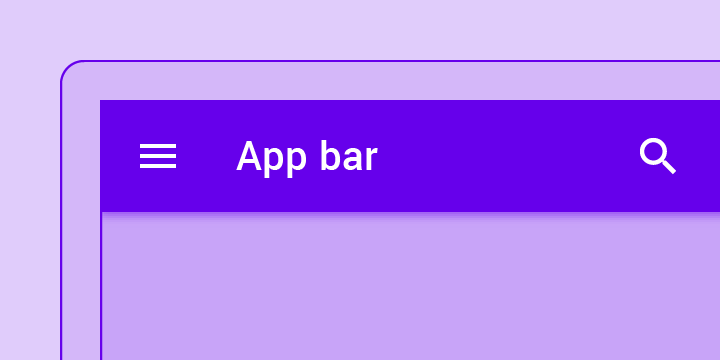
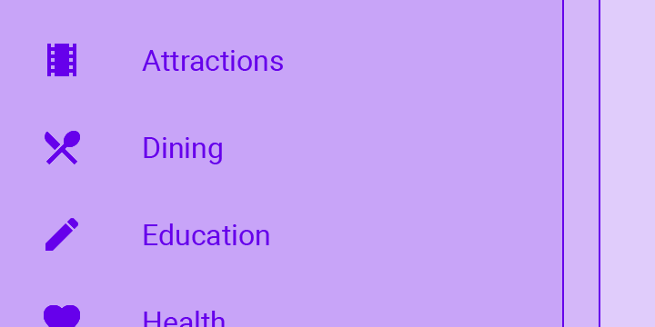
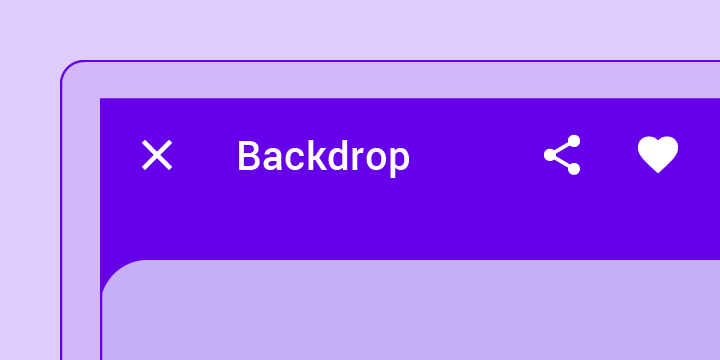
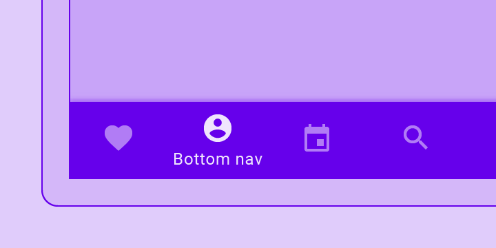
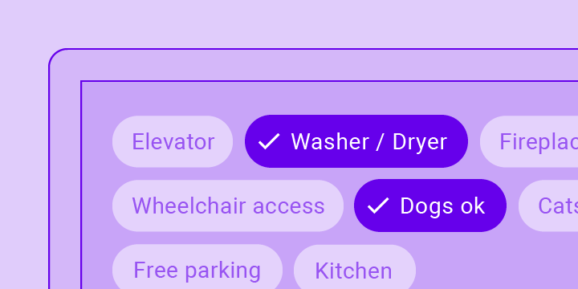
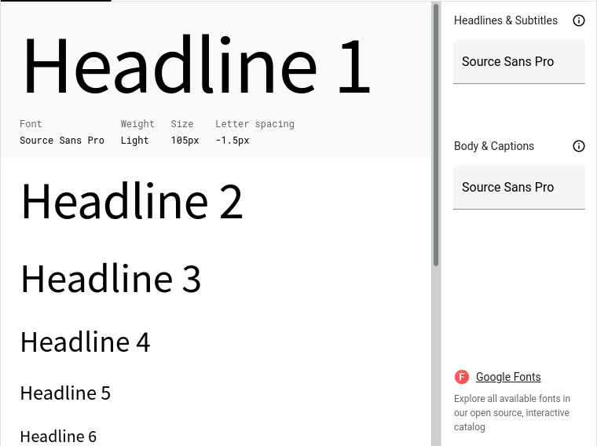
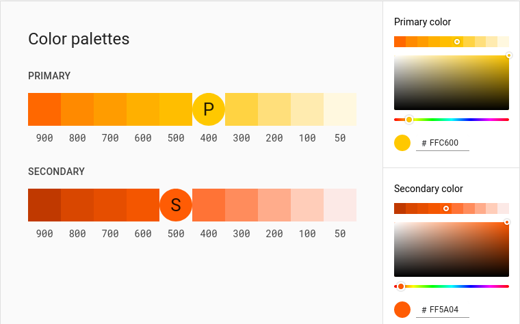

# DIU - Practica 3, entregables

## Análisis de MuseMap   

MuseMap es una aplicación que parte de un concepto muy original que consiste en registrar el nombre de artistas callejeros en un mapa. A partir de ver y analizar esta historia de diseño podremos aprender más sobre nuestra propuesta y justificar el por qué hemos usado las técnicas que hemos usado.

Lo primero y más importante en la historia de MuseMap es que, a diferencia de lo que hemos hecho en las prácticas anteriores, hace mucho más trabajo de planificación anterior. Parte de una idea muy original y la presenta de forma interesante y clara: si alguna vez te has preguntado quién es el artista callejero que ha hecho algo, aquí puedes verlo o registrarlo tú mismo. En dos líneas ha conseguido captar tu atención.

Parten del por qué de la aplicación, sus objetivos y, de forma general, lo que pueden querer los usuarios. Para aumentar más esta idea, van a la calle a estudiar de primera mano el comportamiento de las personas con el arte público y poder conseguir más ideas a tener en cuenta, algo totalmente imprescindible para una aplicación que pretende usarse en la calle, consiguiendo información valiosa como el tiempo que puede tardar una persona en observar el arte callejero, que luego servirá para que la interfaz se adecue a no perder más de ese tiempo.

Una vez realizado un análisis de las personas, pasaron a un análisis de la competencia, muy útil y parecido al nuestro, en el que se ve en una tabla lo que tienen unas y otras aplicaciones. Así, con lo que carecen unas y tienen otras, poder empezar a perfilar la idea y partir de un punto sólido y no de cero: algo que ya existe y mejorarlo.

En MuseMap pudieron tratar con potenciales usuarios reales. Para ello no hicieron un mapa de experiencia, si no que hicieron un mapa de empatía (basado en lo que asumen) en el cual se puede conocer más en profundidad y con más casos el entorno y lo que puede sentir el usuario. Esta me parece una opción mejor a los mapas de experiencia (aunque es bueno complementarla a esta), ya que condensan mejor la información en un solo gráfico. Esto sumado a que ellos, a diferencia de nosotros, pudieron consultar con potenciales usuarios reales, da lugar a un análisis mucho más exhaustivo, con más cantidad y con ejemplos mucho más reales, para tener todo controlado.

Toda esta cantidad de información podría abrumar, sin embargo gracias a que realizaron un mapa de afinidad pudieron organizar mejor las ideas y eliminar las que no fuesen útiles, quedando al final un mejor y más real análisis de usuarios ya que siempre se pueden quedar sin tener en cuenta muchas cosas o haber asumido cosas erróneas, como se dan cuenta en MuseMap.

Al igual que nosotros, además crean dos personas ficticias, pero con un enfoque a la hora de crearlas más interesantes. Yo decidí hacer dos personas totalmente distintas, una mayor y otra menor, sin embargo en este caso deciden hacer una persona que se vea en el entorno de la app (encontrar arte callejero) de forma intencionada o de casualidad, para tener bien cogidos los dos extremos posibles de usuarios. 

Posteriormente hacen el mapa de experiencia al igual que nosotros, pero a partir de este sacan múltiples preguntas que deben resolver mediante un proceso de: problema - pregunta - hipótesis, que puede ser muy interesante para exprimir más las personas, pero termina en un diagrama representando lo que haría un usuario en la app, que resulta redundante ya que veo mejor estudiar luego la propia estructura de la app.

Hacen una matriz 2x2 pero no como el feedback capture grid, si no centrandose en el uso y prioridad de los distintos apartados de la app, cosa que nosotros hacíamos en una tabla y creo que es mejor para así poder ordenar de mayor a menor utilidad las funcionalidades, ya que en el 2x2 está mas desordenado.

Finalmente, crean los prototipos en papel, pero ellos tienen a usuarios que pueden decirles qué está mal para ellos y así poder realizar, en siguientes iteraciones, bocetos más seguros. Sin embargo, hacen el site map después de los bocetos, y no antes, lo cual considero un error porque creo más importante tener en cuenta primero la estructura de todo y luego ya ir a la propia interfaz que debería ser lo último de todo.

En resumen, realizan un análisis mucho más exhaustivo de personas, sobre todo de personas reales, que creo que es imprescindible a la hora de realizar una interfaz de usuario, ya que los propios desarrolladores de esta interfaz pueden cerrarse mucho en si mismos y no tener en cuenta muchas cosas que usuarios reales sí. Existen múltiples técnicas y muchas de ellas podrían prescindirse, para centrarse únicamente en hablar y documentar experiencias de usuarios reales, qué quieren y cómo, para luego (y siempre trabajando con el usuario) realizar directamente el diseño de interfaz.

## Propuesta de elementos de diseño o patrones a usar 

Uno de los patrones de diseño de interfaces más importante que existen a día de hoy y probablemente el más usado es el Material Design, cuyas especificaciones se pueden encontrar en la web [material.io](https://material.io).

Sus objetivos principales son sintetizar los principios de diseño clásicos con la innovación de la tecnología, consiguiendo un sistema que unifique la experiencia de usuario en cualquier plataforma, pero con la suficiente flexibilidad como para que haya mucha innovación. Me parece el estilo de diseño perfecto para cualquiera puesto que las guías son claras y bonitas, lo suficiente como para poder seguirlas al pie de la letra si no eres muy creativo, pero si eres creativo siempre puedes añadir tu propio toque. 

Las tipografías, iconos, espacios, colores, etc pretenden concentrarse en dar una jerarquía y significado simple a todo, para que los usuarios puedan sentir una mayor inmersión en la experiencia.

- Los principios del layout son que sea predecible e intuitivo, consistente y responsivo. Todo el contenido dentro del layout debe estar balanceado, estando alineados una medida exacta, y además no debe cambiar a la vista con diferentes tamaños.
- Define la navegación entre partes de la aplicación con tres tipos (todo esto visto fácilmente desde el site map):
  - Lateral: Moverse entre pantallas del mismo nivel en la jerarquía, todo ello debe estar disponible desde la pantalla principal.
  - Hacia delante: Moverse entre pantallas del mismo nivel de jerarquía hacia delante, siendo las consecutivas pantallas accesibles desde listas, imagenes, botones, links o búsquedas.
  - Hacia atrás: Moverse entre pantallas del mismo nivel de jerarquía hacia atrás, dejando este comportamiento a cómo funcione el botón de ir atrás en cada dispositivo.

- En cuanto a colores, especifica que se debe usar un color primario, para el estilo principal y más visible, y otro secundario, para botones o barras de progreso. Con esto se representa la marca en su totalidad, para luego aplicar variaciones de esta en tonos más claros u oscuros. Los colores deben permitir la legibilidad y, sobre todo, deben ser indicativos de la jerarquía, especificando cuales son clickables o importantes en general (más oscuros encima de blancos).
- Material usa tipografías de Google, que tienen ya un tamaño predeterminado que se redimensiona según para lo que se pretenda usar y el tamaño de la app.
- Los iconos son una de las partes más importantes de este diseño, deben representar elementos físicos fácilmente reconocibles y cuya iluminación y corte debe recordar a un trozo de papel, teniendo sombras muy sutiles y que contrasten con el fondo en el que están estos iconos.

Además, define una serie de "Componentes Material", que aplican los estilos explicados anteriormente, siendo varios de ellos los más importantes:

- Barras de aplicaciones: si están arriba hacen referencia a la pantalla actual, si están abajo hacen referencia a todo. Dentro de ellas está la información en una lista indexada con texto e imagenes autoexplicativas.
- Barra superior: muestra el contenido que se puede accionar en el contexto actual. 

- Barra inferior de navegación: permite el movimiento en los principales contenidos de la aplicación. 

- Burbujas: elementos compactos que representan atributos o acciones. 

En los bocetos propuestos en la práctica 2 se intentaron seguir lo máximo posible estos principios de diseño mostrados, con los componentes descritos y los iconos buscados siguen el patrón Material. Además para el diseño final se deben seguir las siguientes especificaciones de color y tipografía:

- **Tipografía**: **Source Sans Pro**, una tipografía enfocada para el uso en interfaces de usuario. Es la que usa Adobe, por tanto va bien al usarlo con Adobe XD en los prototipos finales.

  

- **Color primario: Naranja amarillento**, **Color secundario: Rojo anaranjado**. Es una gama de colores minimalista, que se adapta a las guías de Material, y cálidos, para reflejar alegría, confianza y tranquilidad. El color primario es el que se usa en el logotipo, ya que es el que tiene que representar la marca en su totalidad.

  

## Historia en Video del UX Case Study

Puedes acceder a la historia en video del UX Case Study en el siguiente enlace de [Youtube](https://www.youtube.com/watch?v=_o0Hp5upIC0)

## Documentación. Valoración del equipo sobre la realización de esta práctica o los problemas surgidos

